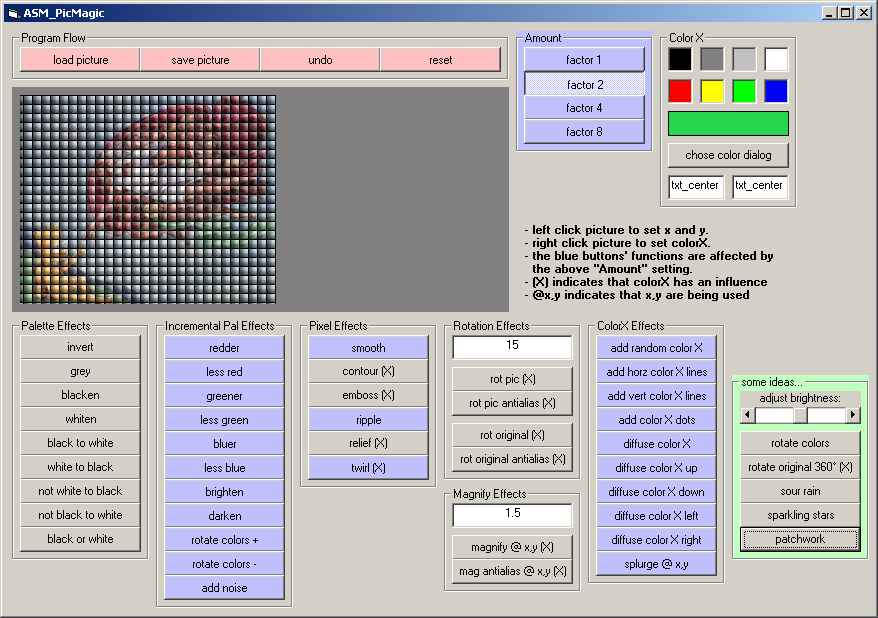



## clsASMpic 1\.0 \- Assembler \(Machine Code\) and PictureBox Magic \- updated

### Description

clsASMpic is a simple class that makes possible REALTIME image manipulation of even large pictures in visual basic.

this is accomplished using precompiled assembler code (machine code) in the time critical sections.

it has a real wealth of functions, eg rotating and scaling with antialiasing, invertion and grayscaling, art effects like relief and smoothing, colour effects - each colour +/-, brightness ...and many more - plus some really nice and weird ideas.

All asm code is by Robert Rayment, thanks a lot for your great work, dude!

this is mostly a total conversion of one of Robert's former postings, to make using this great technique as easy as it is being fast:

http://www.planet-source-code.com/vb/scripts/ShowCode.asp?txtCodeId=29034&lngWId=1 .

I did my best to encapsulate everything into one single class and make calling its powerful functions as easy as possible. information hiding at its best.

by using enums, the functions become self explanatory.

decent error checking, to be improved (for example don't quit your prog until your loop of one degree rotation steps has finished...).

even loading and saving pics with the standard dialog is handled. --- updates: new examples (both main and additional project), possibility to do several effects without drawing each intermediate result (prevents flickering, allows undo of whole filter-arrays), chose color dialog. ---

...have fun experimenting and using this really handy piece of code! :)
 
### More Info
 

             |
---                |---
**Submitted On**   |2001-11-19 12:09:00
**By**             |[buggy](https://github.com/Planet-Source-Code/PSCIndex/blob/master/ByAuthor/buggy.md)
**Level**          |Advanced
**User Rating**    |4.9 (243 globes from 50 users)
**Compatibility**  |VB 6\.0
**Category**       |[Object Oriented Programming \(OOP\)](https://github.com/Planet-Source-Code/PSCIndex/blob/master/ByCategory/object-oriented-programming-oop__1-47.md)
**World**          |[Visual Basic](https://github.com/Planet-Source-Code/PSCIndex/blob/master/ByWorld/visual-basic.md)
**Archive File**   |[clsASMpic\_1491851142002\.zip](https://github.com/Planet-Source-Code/buggy-clsasmpic-1-0-assembler-machine-code-and-picturebox-magic-updated__1-40386/archive/master.zip)

